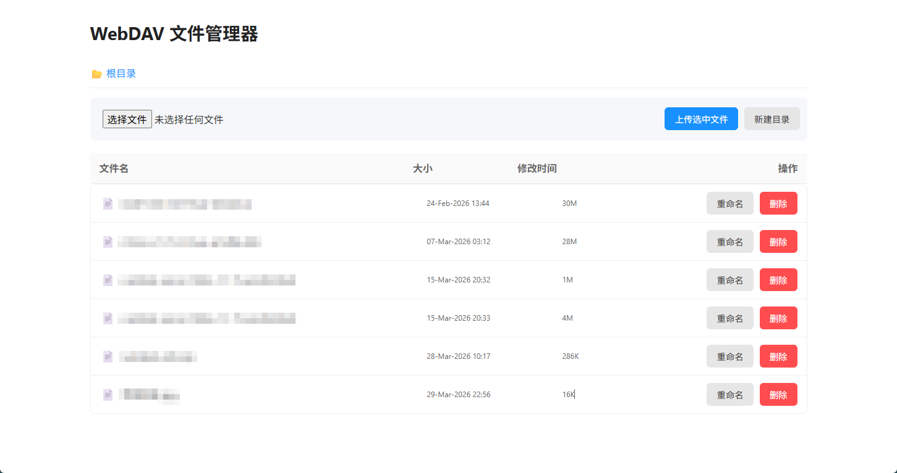
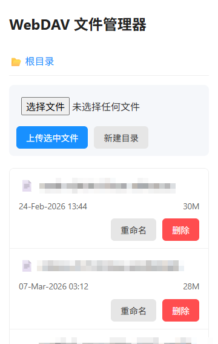

## 中文

不需要PHP等后端服务，结合 Nginx 的 `--with-http_dav_module` 默认模块 + HTTP Basic 认证 + HTML+ JavaScript，在浏览器中，对服务器指定路径（可配置）下，实现文件与子目录的查看、删除、重命名、上传的功能。

使用方法：

1. 准备好`/etc/nginx/conf.d/.htpasswd`文件，可使用[在线htpasswd生成工具](https://rp.t725.cn/serve/?menu=htpasswdGenerator)。
2. 在 Nginx 的站点配置文件中，增加引用 `include conf.d/WebDavManager.nginx;`。
   - 修改`WebDavManager.nginx`文件中第8行的路径
   - 使用配置生效 `sudo ngintx -t && sudo ngintx -s reload`
3. 上传`WebDavManager.html`到 Nginx 的站点根目录下，通过浏览器访问 `https://youdomain/WebDavManager.html`

## English

No backend services like PHP are needed. By combining Nginx's default `--with-http_dav_module` module, HTTP Basic Authentication, HTML, and JavaScript, you can view, delete, rename, and upload files and subdirectories in a specified path on the server (configurable) through the browser.

Usage:

1. Prepare the `/etc/nginx/conf.d/.htpasswd` file, which can be generated using an [online htpasswd generator](https://rp.t725.cn/serve/?menu=htpasswdGenerator).
2. In the Nginx site configuration file, add the reference `include conf.d/WebDavManager.nginx;`.
   - Modify the path on line 8 of the `WebDavManager.nginx` file.
   - Apply the configuration using `sudo nginx -t && sudo nginx -s reload`.
3. Upload `WebDavManager.html` to the root directory of the Nginx site and access it through the browser at `https://yourdomain/WebDavManager.html`.

------

